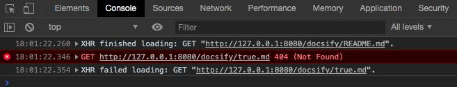

# docsify init config bug

view: https://l3au.github.io/assets/docsify/

Files as below

```bash
.
├── README.md
├── _sidebar.md
├── docisify-all.js # this is key
├── index.html
└── style.css
```

`index.html`

```html
<!DOCTYPE html>
<html lang="zh">
  <head>
    <meta charset="utf-8" />
    <title>docsify init config bug</title>
    <meta name="viewport" content="width=device-width, initial-scale=1" />
    <link rel="stylesheet" href="./style.css" />
  </head>
  <body>
    <div id="app"></div>
    <script>
      window.$docsify = {
        name: 'docsify',
        loadSidebar: true,
      }
    </script>
    <script src="./docsify-all.js"></script>
  </body>
</html>
```

`_sidebar.md`

```markdown
- Head 1
  - Head 2
- Head 1
```

The problem is you won't see the `_sidebar.md` content, and docsify try to load `true.md` file with 404 error.


